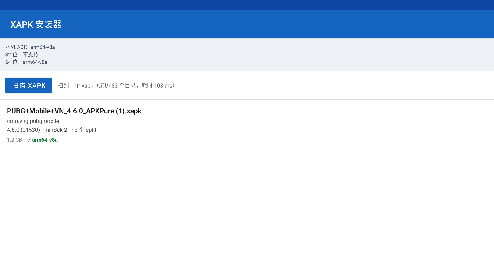
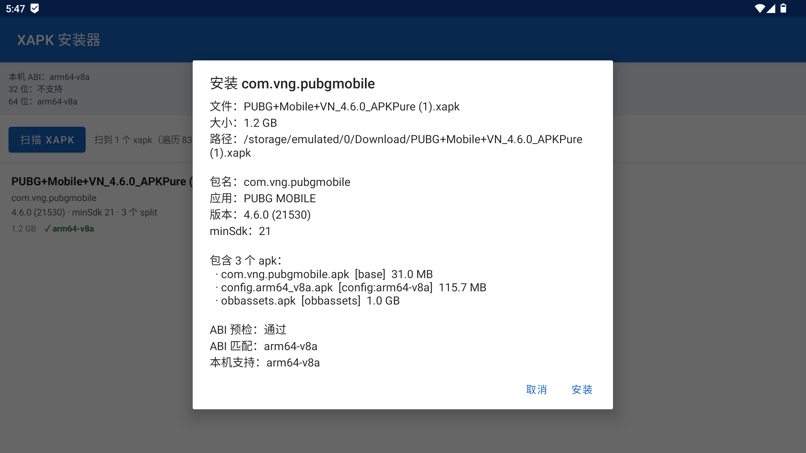
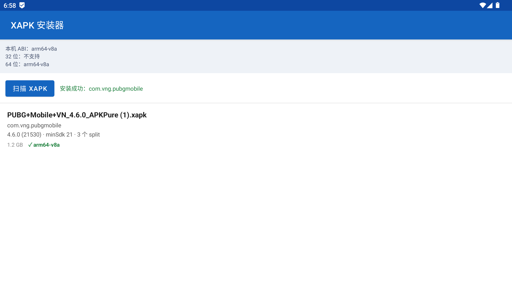

# XAPK Installer

在 Android 设备上**扫描并安装 XAPK** 的小工具。安装前会先做一次 ABI 兼容性预检，能装的直接装，装不了的明确告诉你为什么。

界面和文档都是中文。定位是「只做一件事」：把设备上已有的 `.xapk` 装上去。

- 许可证：MIT
- 最低系统：Android 8.0（API 26）
- 语言：Kotlin，无原生代码（不区分 ABI，任何架构都能装）

<table>
  <tr>
    <td width="33%"></td>
    <td width="33%"></td>
    <td width="33%"></td>
  </tr>
  <tr>
    <td align="center">扫描结果</td>
    <td align="center">详情与 ABI 预检</td>
    <td align="center">安装完成</td>
  </tr>
</table>

## 它解决什么问题

XAPK 本质是个 zip，里面装着 base apk + 若干 split apk（按 ABI、屏幕密度、语言切分）+ OBB 数据。因为它是多个 apk，常规安装方式都用不了：

| 方式 | 结果 |
| --- | --- |
| `adb install game.xapk` | 失败。xapk 没有单个可安装的 Manifest 入口 |
| 文件管理器点开 | 交给第三方安装器，或者根本没有处理它的应用 |
| `adb install-multiple` | 能用，但得先解包、逐个 push，还要自己判断哪个 split 该带 |

系统的 PackageInstaller 一次只接收一个 apk，所以装 XAPK 必须自己开一个安装会话（session），把每个 split 逐个写进去。这个工具就是把这套流程做成一个界面。

## 功能

- 扫描外部存储里的所有 `.xapk`（默认递归 8 层，跳过 `Android/`、`.thumbnails/` 等噪音目录）
- 解析 `manifest.json`，区分各 split 的角色：`base` / `config.<abi>` / `config.<密度>` / `obbassets`
- **ABI 兼容性预检**：装之前先判断这个包在当前设备上能不能跑
- 流式安装，不解压到磁盘
- 安装进度与结果反馈

## 系统要求

| 项 | 要求 |
| --- | --- |
| Android | 8.0（API 26）及以上 |
| 权限 | 「所有文件访问」+「安装未知应用」 |
| 构建 | JDK 17 及以上、Android SDK Platform 35 |

构建工具链版本：AGP 8.9.2、Kotlin 2.0.21、Gradle 8.11.1、compileSdk / targetSdk 35。

## 构建

```bash
git clone https://github.com/bugsos/xapk-installer.git
cd xapk-installer

# 告诉 Gradle 你的 SDK 在哪（二选一）
echo "sdk.dir=$ANDROID_HOME" > local.properties
# 或者直接 export ANDROID_HOME=/path/to/android-sdk

./gradlew assembleDebug
```

产物在 `app/build/outputs/apk/debug/app-debug.apk`。

仓库里带了 Gradle Wrapper，不需要自己预装 Gradle——`./gradlew` 会按
`gradle/wrapper/gradle-wrapper.properties` 里记录的版本（8.11.1）自动下载并缓存。

### 构建已签名的 release

`keystore.properties` 不入库（它含密钥口令），需要自己生成：

```bash
mkdir -p keystore
keytool -genkeypair -v -keystore keystore/release.jks -alias release \
  -keyalg RSA -keysize 2048 -validity 10950
```

然后在项目根写 `keystore.properties`：

```properties
storeFile=keystore/release.jks
storePassword=你的密钥库口令
keyAlias=release
keyPassword=你的密钥口令
```

```bash
./gradlew assembleRelease
# 产物：app/build/outputs/apk/release/app-release.apk
```

没有 `keystore.properties` 时 release 也能构建，只是产出 `app-release-unsigned.apk`（装不上，需要自己签名）。

### 本机快捷脚本

`build.sh` 是给「JDK 和 Gradle 都放在项目里或本机特定位置」的场景用的便捷入口，
它会按 `项目内 .jdk/` → `Homebrew openjdk@17` → `$JAVA_HOME` 的顺序找 JDK：

```bash
./build.sh            # 等价于 ./build.sh debug
./build.sh debug      # → app-debug.apk
./build.sh release    # → app-release.apk（读 keystore.properties）
```

一般使用者用 `./gradlew` 就够了，`build.sh` 只是为了免去手动指定 JDK。

## 使用

1. 把 `.xapk` 放到设备上任意位置（`adb push game.xapk /sdcard/Download/`，或直接在设备上下载）
2. 打开应用，点顶部的「授权」，分别授予**所有文件访问**和**安装未知应用**
3. 点「扫描 XAPK」
4. 点列表里的条目看详情：包名、版本、split 清单、ABI 预检结论
5. 点「安装」，然后在**系统弹出的确认界面**上确认

第 5 步的确认界面是必须的：非系统应用无法静默安装，这是 Android 的硬性限制。ABI 预检不通过时按钮会变成「仍要尝试」，需要二次确认才会提交（万一是预检判断有偏差）。

## 工作原理

### 扫描为什么用 MANAGE_EXTERNAL_STORAGE

Android 11 起的分区存储下，`READ_EXTERNAL_STORAGE` 只授予**媒体文件**的读权限，
`.xapk` 属于非媒体文件，用它扫不到任何东西。所以必须申请「所有文件访问」
（`MANAGE_EXTERNAL_STORAGE`，对应代码里的 `Environment.isExternalStorageManager()`）。

没有用 SAF（`ACTION_OPEN_DOCUMENT_TREE`）是因为安装时需要一个可随机读取的 `File`／流来喂给
PackageInstaller，1GB 以上的包走 SAF 的 `ParcelFileDescriptor` 会很难受；而且每次扫描都要用户授权目录。

### 安装为什么走 PackageInstaller Session API

```
createSession(MODE_FULL_INSTALL)
  → openSession
  → 对每个 split：openWrite(name, 0, size) ← 从 xapk 的 zip entry 流式读入
  → commit(PendingIntent)
```

系统安装器（`ACTION_VIEW` / `ACTION_INSTALL_PACKAGE`）一次只收一个 apk，装不了多 split，所以只能自己开会话。

### 为什么不解压到磁盘

split 直接从 xapk 这个 zip 的 entry 流式写进 session（256KB 缓冲），
装一个 1.2GB 的 xapk 不会额外占用磁盘，也省掉一次落地与清理。

### ABI 预检怎么做的

- 优先从 split 的 id 推断（XAPK 规范里 ABI split 固定叫 `config.<abi>`，如 `config.arm64_v8a`）
- 只有当包里**没有任何 ABI split**（即可能是 universal 包，原生库直接躺在 base 里）时，
  才把其中最小的那个 apk 解出来看它内部的 `lib/` 目录；且只对不超过 400MB 的包做这件事
- 判定依据是设备的 `Build.SUPPORTED_ABIS`

之所以专门做这件事：某些纯 64 位环境（比如部分模拟器，`SUPPORTED_32_BIT_ABIS` 为空、
系统里甚至没有 `/system/bin/linker`）装 32 位包时，系统只会抛一句
`INSTALL_FAILED_NO_MATCHING_ABIS: res=-113`，用户得自己反推原因。预检会直接说：

> 本机是纯 64 位环境（SUPPORTED_32_BIT_ABIS 为空，系统里没有 /system/bin/linker），
> 无法运行任何 32 位原生库。只能换该应用的 arm64-v8a 版本。

### 一个踩过的坑：`STATUS_PENDING_USER_ACTION`（= -1）不是失败

非系统应用走 Session API 安装时，`commit()` 之后系统**先回一个 `-1` 状态**，
再附一个 `Intent.EXTRA_INTENT`（系统确认界面），要求应用把它拉起来给用户点。

```java
STATUS_SUCCESS             =  0
STATUS_FAILURE             =  1
STATUS_PENDING_USER_ACTION = -1   // 不是错误，是「等用户确认」
```

如果不处理这个状态、直接当成失败，安装就会永远停在这一步，界面上表现为一个莫名其妙的
「安装失败（status=-1）」。见 `InstallResultReceiver.kt`。

还有个连带问题：系统确认界面弹出时本 Activity 会 `onPause`，而最终结果广播可能在
Activity 恢复**之前**到达，静态 listener 已经被清空就会丢结果。所以结果需要先暂存，
下次 `onResume` 补收。

## 已知限制

- **只识别 `.xapk`**。单个 `.apk` 不在扫描范围内——那种包用系统的「安装未知应用」流程就能装
- **不能自选目录**，扫描根目录固定为外部存储根目录（递归深度上限 8）
- **不校验签名、不做完整性校验**。装不装得上完全由系统 PackageInstaller 判定
- **不合并 split**，没有「导出 universal APK」这类功能
- universal 包的 ABI 探测有 400MB 上限，超过就退化为「通用包」不再预检
- 一次只安装一个包，没有批量安装与安装队列，也没有后台服务
- `minSdk 26`：Android 8.0 以下不支持

## 目录结构

```
app/src/main/
├── AndroidManifest.xml
├── java/com/xapk/installer/
│   ├── MainActivity.kt            界面、权限申请、扫描与安装的编排
│   ├── XapkScanner.kt             递归扫描外部存储里的 .xapk
│   ├── XapkParser.kt              解析 xapk（zip）与 manifest.json，推断 ABI
│   ├── XapkInfo.kt                数据模型（XapkInfo / SplitEntry）
│   ├── AbiCompat.kt               ABI 兼容性预检
│   ├── XapkInstaller.kt           用 PackageInstaller Session API 安装
│   ├── InstallResultReceiver.kt   安装结果回调（含 PENDING_USER_ACTION 处理）
│   └── XapkListAdapter.kt         列表适配器
└── res/                           布局、主题、图标
build.sh                           本机构建脚本（JDK / Gradle 自动定位）
gradlew · gradle/wrapper/          Gradle Wrapper
```

## 声明

请只安装你有权安装的应用。本工具不提供任何应用下载，也不绕过签名校验或商店的分发限制。

## 许可证

[MIT](LICENSE)
